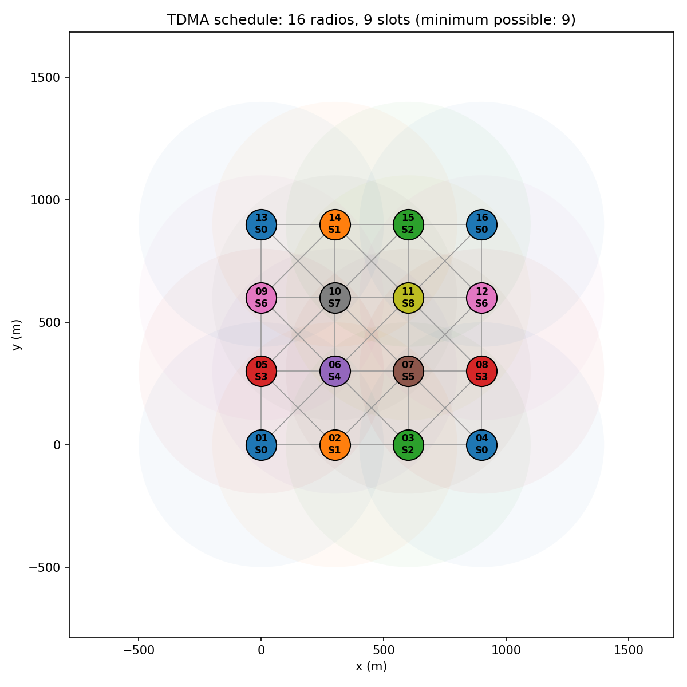

# TDMA Schedule Planner and Optimizer

Collision-free TDMA slot planning with **distance-2 graph colouring**, plus a bridge that turns the schedule into an **EMANE TDMA schedule event**.

Submission for the Vaan Megam Networks Wireless Developer Internship assignment.

| | |
|---|---|
| Documentation (PDF) | [docs/TDMA_Scheduler_Documentation.pdf](docs/TDMA_Scheduler_Documentation.pdf) |
| Presentation (PPT) | [docs/TDMA_Scheduler_Presentation.pptx](docs/TDMA_Scheduler_Presentation.pptx) |

## Headline results

* **4×4 grid (300 m spacing, 500 m range): 9 slots, proven optimal.** Node_06 has 8 neighbours, so 9 is the minimum any schedule can use.
* **0 collisions**, confirmed by an independent verifier that re-measures hop distances.
* **200 out of 200** random networks (16 to 150 radios) solved at the proven lower bound, in under 0.2 s each.
* A naive one-hop schedule would use 4 slots but cause **24 hidden-terminal collisions**.



## Quick start

```bash
pip install -r requirements.txt

# Part 1: the brief's JSON string input
python3 schedule.py '{"Node_01":[0.0,0.0],"Node_02":[300.0,0.0],"Node_03":[600.0,0.0]}'

# or from a file, with a picture and JSON for Part 2
python3 schedule.py --file examples/grid_4x4.json --plot output/grid.png --json-out output/schedule.json

python3 tests/test_schedule.py   # tests
python3 benchmark.py             # stress test (16 to 150 radios)
python3 make_figures.py          # regenerate every figure

# Part 2: convert to EMANE (no EMANE needed for this step)
python3 emane/bridge.py output/schedule.json            # -> emane/generated/
python3 emane/bridge.py output/schedule.json --naive    # comparison schedule

# Part 2: live run (Linux or Docker, a few GB of free disk)
docker build -t tdma-emane emane/
docker run --rm -it --privileged -v "$PWD":/work tdma-emane bash emane/run_demo.sh
```

Options: `--range` (metres, default 500), `--rounds` (iterated greedy rounds), `--seed`, `--exact-seconds` (time limit for the exact search), `--plot`, `--json-out`. The exit code is 1 if verification fails.

## How it works

1. **Radio graph:** connect radios within 500 m.
2. **Conflict graph G²:** for every radio B, also connect every pair of B's neighbours, because they would collide at B (hidden terminal). Distance-2 colouring of G is then ordinary colouring of G².
3. **Heuristics:** Largest-First, Smallest-Last and DSATUR greedy colouring; keep the best.
4. **Improve:** Culberson's iterated greedy (never worse), then a time-limited exact backtracking search.
5. **Prove and verify:** degree and clique lower bounds give a "proven optimal" stamp; an independent verifier checks every same-slot pair.

## Repository layout

```
schedule.py          CLI (Part 1 deliverable)
tdma/topology.py     radio graph and conflict graph
tdma/coloring.py     heuristics, iterated greedy, exact search
tdma/analysis.py     lower bounds, verifier, spatial reuse report
tdma/report.py       ASCII report, Slot x Node matrix, JSON export
tdma/plot.py         figures
emane/               Dockerfile, EMANE XML profiles, bridge, run script, traffic test
examples/            input layouts (grid, convoy, clusters, random)
output/              reports and figures
tests/               tests
docs/                documentation PDF and presentation
```

## Part 2 status

The bridge, the XML profiles and the run script are complete, and the bridge is tested (schedule to XML and back is identical). The live EMANE run was not executed: the EMANE source build stopped because the development laptop ran out of disk space. Details and the planned experiment are in the documentation, section 5.
